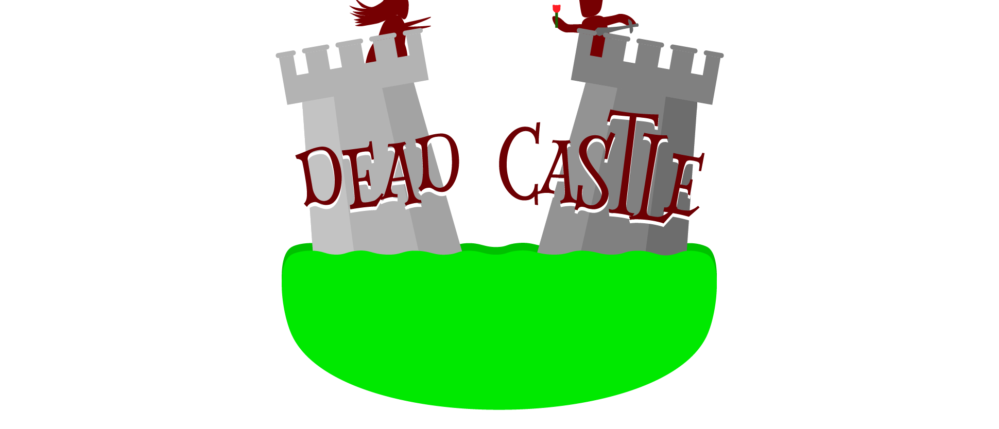

### 
 DeadCastle • <a href="https://deadcastle.netlify.app" > deadcastle.netlify.app </a> 

### 1. Description

the princess has been kidnapped by several monsters, so prince Walid wants to save her,  
therefore, we are going to follow Walid in his adventure in the dead castle. 
to save the queen, the prince must kill different monsters, pass different obstacles and find his way out of the forgotten maze.

### 2. Why?
Our school Hectic gave as a Front-end project for 2 weeks to make a javascript game.

### 3. Team and Task sharing 
[Dridi Mohamed Amine](https://github.com/dridi19): functions (kill monster, take damage from a monster or while walking on spikes,change the animation while walking, display of Hp, picking up keys, opening door,speak with npcs)
[Gouja]:  assets\ style of the dialogues\ the ideas of the project (the improvements and the course of the game)\the name of the game;
[Rogier]: contribute to assets and especially the maps
[Rekik]: occupied to make the walls impassable and to put a limit where the Hero can navigate / creation and resizing of characters
[Ghazal]:  logo \ the interface of the beginning and the end of the game \ background of the page \ assets \ map
[Benmansour]: css interface of the project above the map

### 3. Possible improvements:
battle sounds.
A celebration of victory.
A multiple choice of avatars.
A source of energy that will make the prince heal.

### 4. What we learned:
Coding improvements
Using classes
Object manipulation
Using event listeners
Create some clean code.
The method and how to create a dungeon crawler type game
